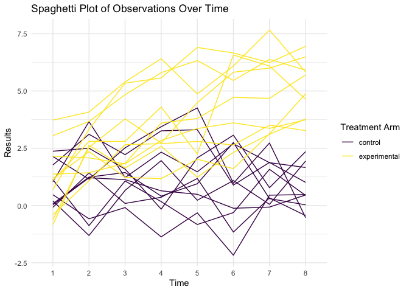

Homework 5
================
Melike Aksoy
2023-11-14

``` r
library(tidyverse)

theme_set(theme_minimal() + theme(legend.position = "bottom"))

options(
  ggplot2.continuous.colour = "viridis",
  ggplot2.continuous.fill = "viridis"
)

scale_colour_discrete = scale_colour_viridis_d
scale_fill_discrete = scale_fill_viridis_d
```

## Problem 2

This zip file contains data from a longitudinal study that included a
control arm and an experimental arm. Data for each participant is
included in a separate file, and file names include the subject ID and
arm.

Create a tidy dataframe containing data from all participants, including
the subject ID, arm, and observations over time:

Start with a dataframe containing all file names; the list.files
function will help Iterate over file names and read in data for each
subject using purrr::map and saving the result as a new variable in the
dataframe Tidy the result; manipulate file names to include control arm
and subject ID, make sure weekly observations are “tidy”, and do any
other tidying that’s necessary Make a spaghetti plot showing
observations on each subject over time, and comment on differences
between groups.

``` r
# Start with a dataframe containing all file names; the list.files
longstudy_files <- list.files("data", full.names = TRUE)

# creating the function
read_data_frames <-
  function(file_path) {
    long_data <- read_csv(file_path)
    long_data <- mutate(long_data, ID = str_remove(basename(file_path), "\\.csv"), # creating tidy ID variable
                        arm = case_when(
                          str_detect(ID, "con_") ~ "control",
                          str_detect(ID, "exp_") ~ "experimental",
                          TRUE ~ NA_character_
  )
  ) # creating tidy arm variable which corresponds to treatment arm that subject belongs to
  return(long_data)
  }

# Iterate over file names and read in data for each subject using purrr::map
list_datasets <- purrr::map(longstudy_files, ~read_data_frames(.))

# Binding rows to merge datasets
longstudy_combined_df <- bind_rows(list_datasets) # binding rows to create the dataset
```

``` r
# changing the data format from wide to long for longitudinal data analysis
longstudy_df=
    pivot_longer(longstudy_combined_df, week_1:week_8,
      names_to = "Week", 
      values_to = "Results") |> 
      mutate(Week = str_remove(Week, "week_"))
```

``` r
ggplot(longstudy_df, aes(x = Week, y = Results, group = ID, color = arm)) +
  geom_line() +
  labs(title = "Spaghetti Plot of Observations Over Time",
       x = "Time",
       y = "Results",
       color = "Treatment Arm") +
  scale_color_viridis_d(option = "viridis") +
  theme_minimal()
```

<!-- -->

##### Explanations:

Overall, the results for experimental group was higher than control
group during 8 weeks. Compared to control group, the changes in
individuals’ results showed a steeper increase in experiemental group.

## Problem 3

When designing an experiment or analysis, a common question is whether
it is likely that a true effect will be detected – put differently,
whether a false null hypothesis will be rejected. The probability that a
false null hypothesis is rejected is referred to as power, and it
depends on several factors, including: the sample size; the effect size;
and the error variance. In this problem, you will conduct a simulation
to explore power in a one-sample t-test.

First set the following design elements:

Fix n=30 Fix σ=5 Set μ=0 Generate 5000 datasets from the model

x∼Normal\[μ,σ\]

For each dataset, save μ̂ and the p-value arising from a test of H:μ=0
using α=0.05. Hint: to obtain the estimate and p-value, use broom::tidy
to clean the output of t.test.

Repeat the above for μ={1,2,3,4,5,6}, and complete the following:

Make a plot showing the proportion of times the null was rejected (the
power of the test) on the y axis and the true value of μ on the x axis.
Describe the association between effect size and power.

Make a plot showing the average estimate of μ̂ on the y axis and the true
value of μ on the x axis. Make a second plot (or overlay on the first)
the average estimate of μ̂ only in samples for which the null was
rejected on the y axis and the true value of μ on the x axis. Is the
sample average of μ̂ across tests for which the null is rejected
approximately equal to the true value of μ? Why or why not?

``` r
set.seed(12345)
```
